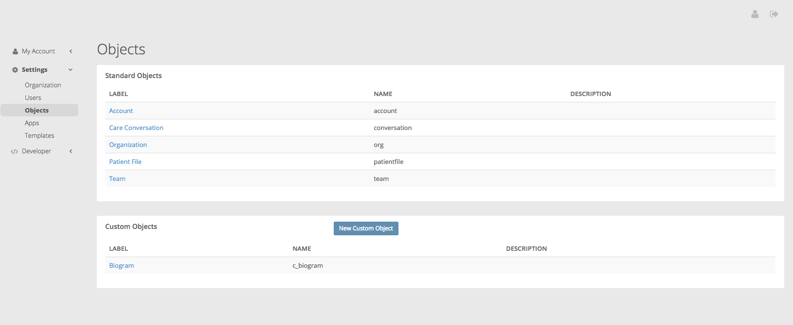
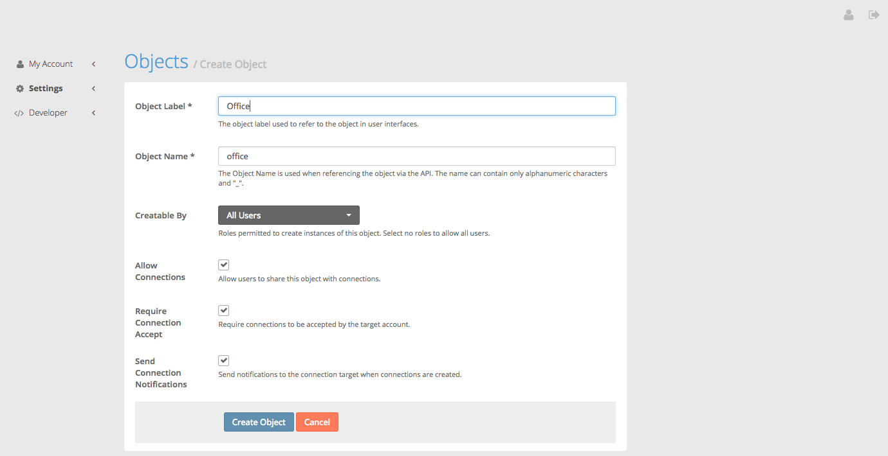
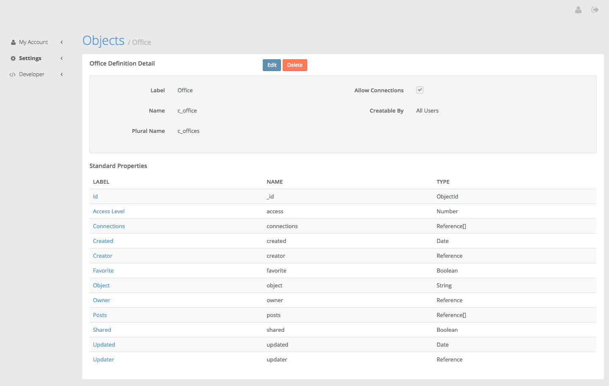
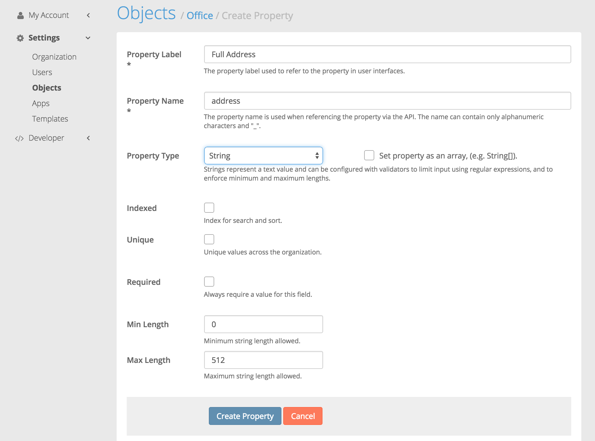

Setting up your Data Model
====

This tutorial covers how to set up your data model with Medable. It *does not* cover how to choose an appropriate data model for your varied use cases, which is a topic best left for CS courses.

If you still haven't set up your Medable Organization, head up to the [tutorial home](README.md).

Medable supports a [list of base objects](https://dev.medable.com/#objects) that should suit your development needs for creating basic medical applications:

- [Accounts](https://dev.medable.com/#accounts)
- [Patient Files](https://dev.medable.com/#patient-files)
- [Care Conversations](https://dev.medable.com/#care-conversations)
- [Teams](https://dev.medable.com/#teams)
- [Organizations](https://dev.medable.com/#organizations)
- [Connections](https://dev.medable.com/#connections)
- [Notifications](https://dev.medable.com/#notifications)
- [Posts](https://dev.medable.com/#posts)
- [Comments](https://dev.medable.com/#comments)

In addition to base objects, you can create custom ones tailored to your specific needs and extensions to base objects following the same pattern used for custom. For this to make sense, let's cover some terms used in this document.

Glossary
----

### Primitive Types

Primitive Types are the standard types supported by Medable, a definitive list can be found in the [API documentation](https://dev.medable.com/#primitive-types).

Here is the list:

- [Any](https://dev.medable.com/#any-types)
- [Booleans](https://dev.medable.com/#booleans)
- [Dates](https://dev.medable.com/#dates)
- [Documents](https://dev.medable.com/#documents)
- [Files](https://dev.medable.com/#files)
- [Numbers](https://dev.medable.com/#numbers)
- [Object IDs](https://dev.medable.com/#objectids)
- [References](https://dev.medable.com/#references)
- [Strings](https://dev.medable.com/#strings)
- Array: Any property can be defined as an array of the aforementioned primitive types.

### Custom Property

A custom property is a property that holds values for any primitive type. They are only called *custom* because they can be created by people with Developer or Admin roles in your Medable Organization.

From now on, we'll just call them properties, regardless of whether they are custom or not.

A property is defined by it's name and type. Custom properties will have a name with the *"c_"* prefix.

As an example, consider a custom property that holds the value of allergies of a person, this could be represented as an Array of Strings.

### Custom Objects

A custom object holds any number of properties and essentially models a real life concept you wish to have represented.

An example could be an Office:

- Object Label: ```"Office"```
- Object Name: ```"c_office"```
- Properties:
	- Address
		- Label: ```"Full Address"```
		- Name: ```"c_address"```
		- Type: ```String```
	- Building
		- Label: ```"Building"```
		- Name: ```"c_building"```
		- Type: ```Reference```
	- Number
		- Label: ```"Office Number"```
		- Name: ```"c_officeNumber"```
		- Type: ```String```
	- Phone
		- Label: ```"Phone Number"```
		- Name: ```"c_phoneNumber"```
		- Type: ```String```

Note that this doesn't pretend to properly model all the information about an office you might want to hold in your system but to serve as an example of one.

### Extensions

Extension is a term used for base objects that have had (custom) properties added to them, e.g. Account would be said to be extended if you add an allergies property to it.

If fact, as for the previous example, the allergies property would be a good candidate to add in an extension to accounts.

Adding Custom Objects
----

In your Organization web administration panel, go to ```Settings / Objects```. You will see a list of base and custom objects as well as extensions.

The next figure shows an example.



Choose the ```New Custom Object``` button to get started on creating a new object.

The next figure shows this step.



Now we can see the object has been created and more information is provided.



Adding Properties to your Objects
----

Now that you've created a new object, add as many properties as you'd like to it. Let's continue with the previous example and add properties to the ```Office``` object.

Tap on the ```New Property``` button under the ```Custom Properties``` section. Fill in the information in the form and select ```Create Property```.



You will notice a few things:

- Arrays are not part of the Type dropdown, you must first select the base type and then you can optionally make the property an Array of this subtype.
- Use the ```indexed``` and ```unique``` to modify the way these values are stored in the backend database. This can improve performance and make these values searchable.
- Use ```required``` to force errors when users attempt to create an instance of the parent object without a value for this property.
- Different types allow for different customizations (e.g. String has a capacity limit, Number values can be decimal only, etc.).

### Reference Type

References demand a source object type where these references will end up pointing to. In the office case, we need to first create a ```Building``` object for this source type to be available as a selection.

### Document Type

A Document type is a recursive entity. Documents can be as complex as Objects themselves. For instance, in a real world scenario, an address is best represented as a document that includes separate subproperties for number, street name, zip code, etc.

We expect that once you've mastered objects, Document property types will feel natural to you.

----

*Don't worry about messing up, you can always Edit and Delete your objects and properties while you are testing.*

----

Once you feel comfortable with how you've set up your Data Model, continue on to [Writing Registration and Login modules](login.md).